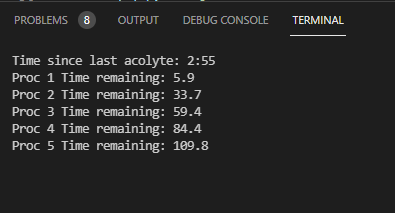

# smeeta-affinity-tracker
**AS ALWAYS USE AT YOUR OWN RISK** -> However, nothing here breaks TOS

Track Smeeta's affinity buff, and always know when it will expire.

Has audio and visual indicators, you can finally relax and listen to music while farming without worrying you will miss a proc!

# Tutorial
- **Install python if you dont have it**
- **Pip install these (on command line type these):**

  pip install pytesseract

  pip install opencv-python

  pip install numpy

  pip install playsound

  pip install keyboard

  pip install pywin32

  python -m pip install --upgrade pip setuptools

  python -m pip install --upgrade lz

- **Run scan.py**
- **Put Warframe in Borderless Fullscreen**
- **Disable Optimized Flip Model in Warframe settings**
- Make sure UI scale is set to 100%
- **(literally) Profit?**
- **Still don't get it? Watch tutorial ->** https://youtu.be/UURx-oBQPks

# Features

- Press ` to play time remaining (under escape key)
- View time remaining for each proc in the terminal
- View time since last Acolyte spawned

# Notes

- ***USE AT YOUR OWN RISK***
- Reads your ee.log, which contains sensitive information (like your IP), however none of that is used in the program nor is it sent anywhere. If you don't feel comfortable, read the code or just don't use it
- Made for 100% UI scale, no guarantees about other settings
- Only works for Windows
- Uses image recognition, will probably not get you banned
